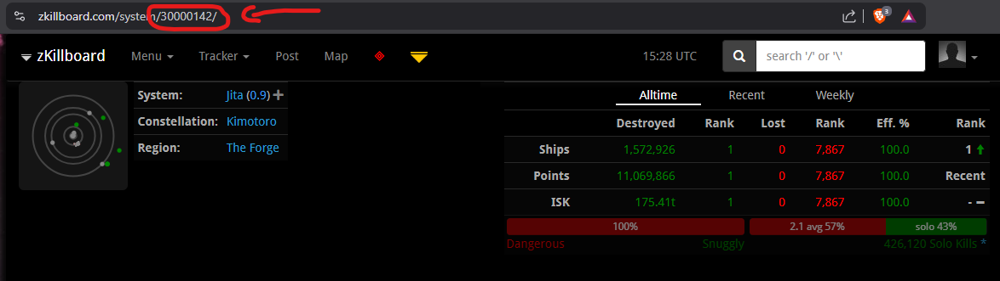

# FINDING GANKERS 
Simple approach for gathering gankers intel from ZKillboard API.

## CHOOSE A SYSTEM ON ZKILLBOARD
Example (Jita): [https://zkillboard.com/system/30000142/](https://zkillboard.com/system/30000142/)

The trailing ID in the URL above is the System ID you want to use in the script to fetch kills.



## USE THE SYSTEM ID IN THE SCRIPT
At the very top of the scirpt you'll find this line: 
```
SYSTEM_ID="30000142" # <-- CHANGE THIS TO TARGET SYSTEM
```
This is where you wanno paste the System ID you just got before running the script.


